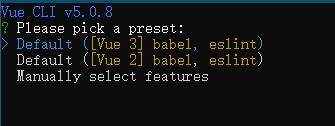
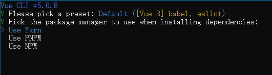
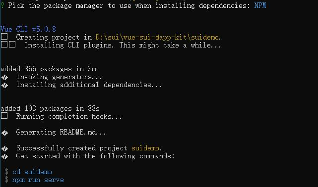
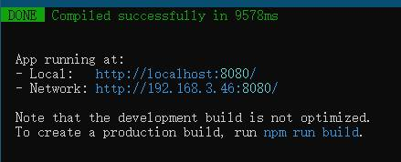
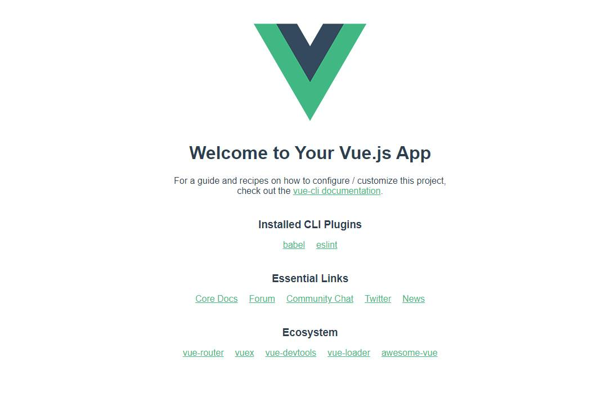

# vue-sui-dapp-kit
vue-sui-dapp-kit

# Demo目录 
* suidemo 试验工程
* suidemodoc 文档截图目录

## 首先本地安装 Vue
```
    npm install -g @vue/cli
```

* demo工程使用vue3



## 安装Vue成功后测试是否能够建立项目
```
    vue create suidemo
```


* Yarn PNPM NPM 根据喜好选择(我选择NPM)


* 安装vue成功后可以根据提示测试一下

执行
```
 npm run serve
```

* 一切正常将在本地起一个网页服


* 将 http://localhost:8080/ 填入浏览器后将看到效果,说明本地vue已经搭建成功


* 接着让我们愉快的推进吧
* 未完待续...

